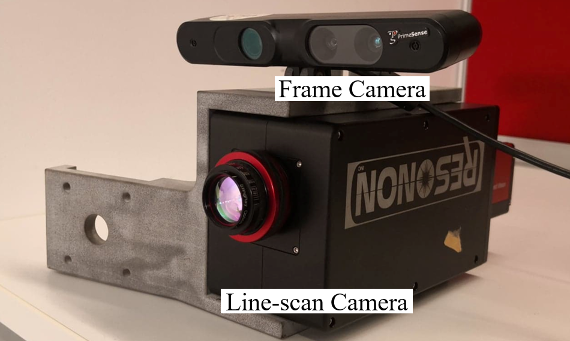
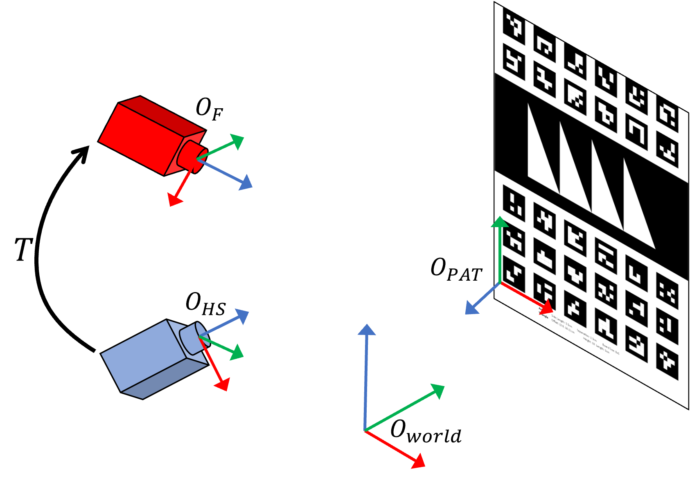
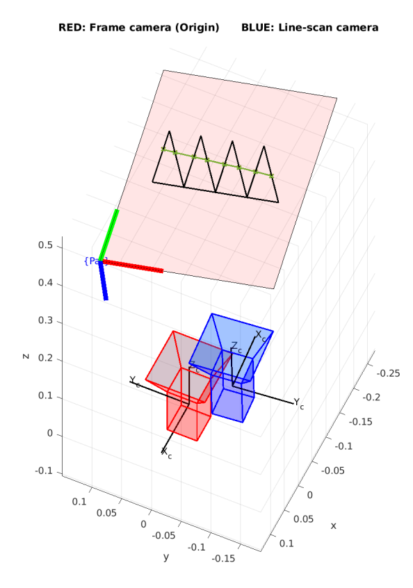
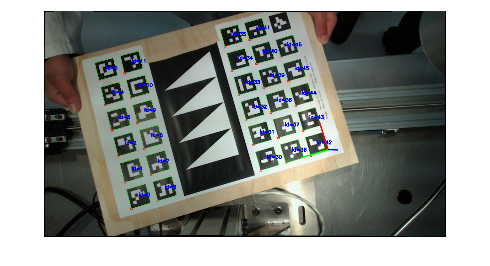
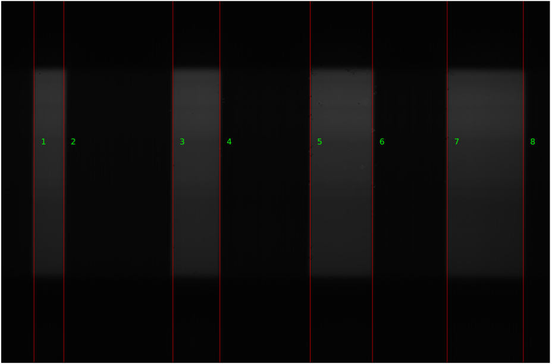
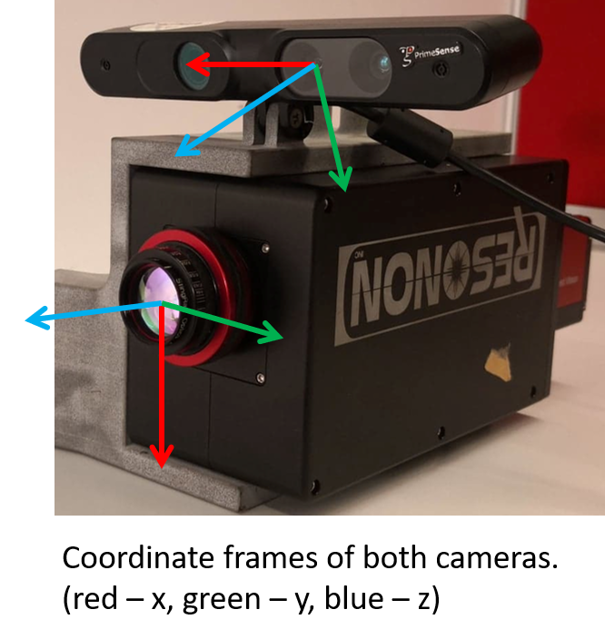
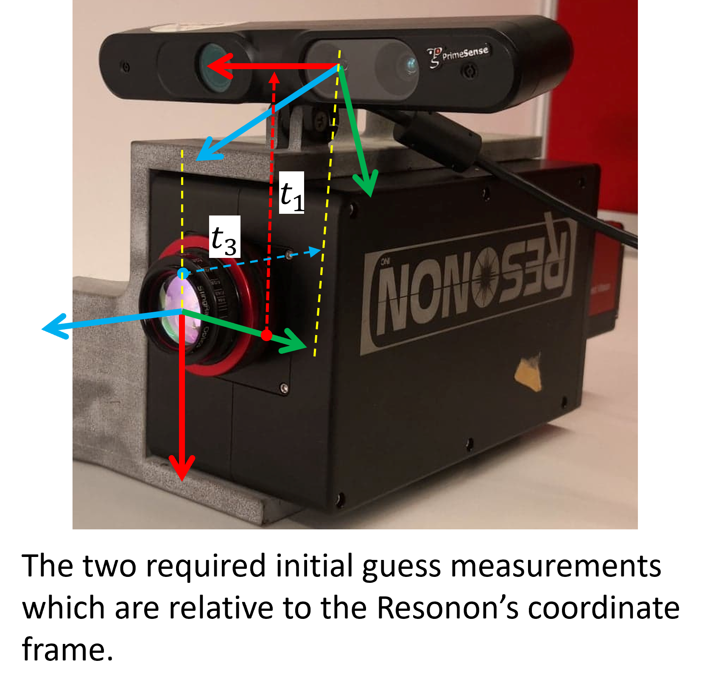

<!-- Improved compatibility of back to top link: See: https://github.com/othneildrew/Best-README-Template/pull/73 -->
<a name="readme-top"></a>
<!--
*** Thanks for checking out the Best-README-Template. If you have a suggestion
*** that would make this better, please fork the repo and create a pull request
*** or simply open an issue with the tag "enhancement".
*** Don't forget to give the project a star!
*** Thanks again! Now go create something AMAZING! :D
-->


<!-- PROJECT SHIELDS -->
<!--
*** I'm using markdown "reference style" links for readability.
*** Reference links are enclosed in brackets [ ] instead of parentheses ( ).
*** See the bottom of this document for the declaration of the reference variables
*** for contributors-url, forks-url, etc. This is an optional, concise syntax you may use.
*** https://www.markdownguide.org/basic-syntax/#reference-style-links
-->

<div align="center">

[![Contributors][contributors-shield]][contributors-url]
[![Forks][forks-shield]][forks-url]
[![Stargazers][stars-shield]][stars-url]
[![Issues][issues-shield]][issues-url]
[![MIT License][license-shield]][license-url]
[![reposize][reposize-shield]][reposize-url]

[![LinkedIn][linkedin-shield]][linkedin-url]
[![portfolio][portfolio-shield]][portfolio-url]

</div>

<h1 align="center">Line-scan Frame Camera Calibration</h1>

<p align="center">
   
    
    
</p>

---

**Table of Contents**
- [Research Paper](#research-paper)
- [About](#about)
- [Requirements](#requirements)
- [Submodule](#submodule)
- [Calibration Board](#calibration-board)
- [Calibration Images](#calibration-images)
- [Data Directory](#data-directory)
- [Frame Camera Intrinsic](#frame-camera-intrinsic)
- [Setup Steps](#setup-steps)
- [Calibration Configuration](#calibration-configuration)
- [Initial Guesses](#initial-guesses)
- [Results](#results)
- [TODO](#todo)
- [License](#license)
- [Contact](#contact)
- [Acknowledgments](#acknowledgments)

---

## Research Paper

You can find my research paper here which describes the active calibration algorithm:

[Observability driven Multi-modal Line-scan Camera Calibration](https://ieeexplore.ieee.org/abstract/document/9235226)

```tex
@inproceedings{mehami2020observability,
  title={Observability driven multi-modal line-scan camera calibration},
  author={Mehami, Jasprabhjit and Vidal-Calleja, Teresa and Alempijevic, Alen},
  booktitle={2020 IEEE International Conference on Multisensor Fusion and Integration for Intelligent Systems (MFI)},
  pages={285--290},
  year={2020},
  organization={IEEE}
}
```

## About

A probabilistic calibration framework for calibrating a camera system comprised of a line-scan camera and a 2D frame camera. This framework includes uncertainty estimation, due to measurement noisy, where the optimised calibration parameters are returned with an associated error. The camera system is assumed to be rigidly mounted together and calibration is performed using a calibration pattern with triangle features and cross-corner markers.

The observability is an important aspect in this calibration as it is common to capture the calibration pattern in similar poses. These similar poses do not have sufficient parallax, so they do not provide any more information to support the calibration, and in some cases they degrade the results. An active calibration algorithm is implemented which only keeps measurements that improve parameter observability, and ignore all others.

<p align="center">
    
</p>

<p align="right">(<a href="#readme-top">back to top</a>)</p>

## Requirements

- MATLAB 2020a or higher (Tested with 2021b)
- GCC 7.0 or higher (Tested with 7.5.0)
- OpenCV 4.0 or higher

## Submodule

This repository has a submodule. Make sure to add the `--recurse-submodules` flag when pulling or cloning.

```bash
#clone repo and submodules
git clone --recurse-submodules **REPO**

#first clone repo and then initialise and update submodule
git clone **REPO**
git submodule init
git submodule update
```

## Calibration Board

The calibration is performed using a pattern with known triangles on an ArUco board as shown below. The triangles provide feature points for the line-scan camera. **All triangles must be visible in the FOV of the line-scan camera in order to properly calibrate.** The ArUco board markers are used by the frame camera to acquire the board's pose automatically using OpenCV functionality (further details of the ArUco board estimation can be found in the [README](./ext_lib/mex_ChArUco_Pose/README.md) of submodule).

An A3 PDF version of the board can be found in [calibration_board](./calibration_board) and its corresponding dimension measurements which are used in the calibration are saved in the file [config.yaml](./config.yaml)

<p align="center">
    
</p>

## Calibration Images

When capturing calibration images, the board should be moved and rotated such that there are variations in the set of calibration images. Atleast two ArUco markers should be present in the frame camera image to estimate the board pose (see [PnP algorithm](https://en.wikipedia.org/wiki/Perspective-n-Point)) and eight line features should be detected in the line-scan image as shown below.

<div style="display:flex;justify-content:center;">
    
    
</div>
<br>

## Data Directory

The calibration data should be organised as follows:

```plaintext
Calibration_Data_directory
├── Frame
	├── img1.png
	├── img2.png
	└── ...
├── Line-scan
	├── hs1.png
	├── hs2.png
	└── ...
├── frame_camera_intrinsic.mat
└── calibration_results (generated after successfully running calibration script)
```

*Both Frame and Line-scan directories should have the same number of images.*

<p align="right">(<a href="#readme-top">back to top</a>)</p>

## Frame Camera Intrinsic

The intrinsic parameters of your Frame (RGB) camera must be **calibrated prior** to performing this calibration. This can be done through checkerboard calibration using MATLAB's calibration [app](https://au.mathworks.com/help/vision/ref/cameracalibrator-app.html). The saved intrinsic parameters should be stored with that data with the filename `frame_camera_intrinsic.mat` . Inside of the MAT file is a MATLAB [cameraParameters](https://mathworks.com/help/vision/ref/cameraparameters.html) object with the name **cameraParams**.

<p align="right">(<a href="#readme-top">back to top</a>)</p>

## Setup Steps

1. Extract images from Rosbag by running the script`Rosbag_Unpack_LineScan_Frame_Cameras.m` located in [rosbag_processing](./rosbag_processing) in MATLAB

   Pass Rosbag location to first window

   A new directory will be created called `*NAME OF Rosbag*` and inside of that directory will be `Frame` and `Line-scan` directories containing images.

   *Note: Extraction and saving might take a couple of minutes*

2. Compile ArUco pixel detection MEX function from submodule

   ```bash
   cd ext_lib/mex_ChArUco_Pose/
   mkdir build
   cd build
   cmake ..
   make -j
   ```

3. Edit the calibration configuration file [config.yaml](./config.yaml) as needed. Details of the calibration configuration are described in the next section.

4. Run calibration script `Main_Calibration.m`  Pass the directory location of the extracted images  `Images/*NAME OF BAG*/`  which contains the `Frame` and `Line-scan` directories.

5. Check that the line-scan lines are properly aligned to the frame camera images. If  successful, the results will be saved in the directory `calibration_results`. If results already exist, program will ask if you want to override results.

<p align="right">(<a href="#readme-top">back to top</a>)</p>

## Calibration Configuration

Configuration parameters found in the [config.yaml](./config.yaml) file.

| Flags                | Description                                                  |
| -------------------- | ------------------------------------------------------------ |
| display_on           | TRUE/FALSE Turns the intermediate visualisations on/off. Turn off to speed up processing |
| t1_approximate       | The approximate distance from Resonon to RGB camera along the positive x-axis of Resonon *(see below for further details)* |
| t3_approximate       | The approximate distance from Resonon to RGB camera along the positive z-axis of Resonon *(see below for further details)* |
| flip_linescan_img    | TRUE if the x-axis of the pattern is in the opposite direction to the y-axis of the Resonon |
| naive_calibration    | TRUE/FALSE runs naive calibration with all images, else runs active algorithm |
| algorithm            | Algorithm for solving the optimisation. <br />1 - Levenberg-Marquardt (default)  <br />2 -Trust-Region-Reflective<br />The trust-region-reflective generally will result in proper calibration parameters as it takes in constraints that will ensure the intrinsics of the hyperspectral camera are in proper range. (These should generally remain fixed) |
| steadystate_readings | Stopping criteria for the active algorithm. Minimum number of consecutive optimisations until steady-state is reached. Checks the sum of the relative change in eigenvalues for each optimisation (referred to as summed normalised metric). |
| minimum_eigen_value  | Minimum eigenvalue magnitude. This avoids having to deal with values close to 0. |
| sum_eigen_threshold  | Threshold value for the summed normalised metric. Default value is 0 to ensure there is an increase in information. |
| skip_covariance      | TRUE/FALSE skipping covariance/error estimation. **Can only skip if naiveCalibration is TRUE** |
| std_pixel_error      | STD of pixel error for all cameras (default value 1)         |
| lower_bounds         | Lower bounds for trust-region-reflective algorithm in the vector form [tx, ty, tz, qw, qx, qy, qz, fy, v0, K1, K2, P2] |
| upper_bounds         | Upper bounds for trust-region-reflective algorithm in the vector form [tx, ty, tz, qw, qx, qy, qz, fy, v0, K1, K2, P2] |
<p align="right">(<a href="#readme-top">back to top</a>)</p>

## Initial Guesses

The closed form solution of the calibration requires an initial guess be given for the **t<sub>1</sub>** and **t<sub>3</sub>** parameters. This will avoid the calibration converging to an incorrect mirror pose. The diagram below demonstrates the required approximate measurements of the initial guess (should be measured in **metres**):

<p float = "center">


</p>

Note that the extrinsic transformation describes the pose of the frame camera axis with respect to the line-scan camera axis. **In the above example both guesses would be negative.**

<p align="right">(<a href="#readme-top">back to top</a>)</p>

## Results

Results are saved as a MAT file called `optimised_parameters.mat` which stores all the necessary data after calibration. Load this file into MATLAB.

The final optimised calibration parameters can be found in the matrix **linescan_Opt_Param**. This is a `n x 11`  matrix where each column represents values for each of the 11 calibration parameters [**t<sub>1</sub>**, **t<sub>2</sub>**, **t<sub>3</sub>**,  **r<sub>z</sub>**, **r<sub>y</sub>**, **r<sub>x</sub>**, **f<sub>y</sub>**, **v<sub>0</sub>**, **K<sub>1</sub>**, **K<sub>2</sub>**, **P<sub>2</sub>**]. The **last** row contains the final optimised parameters you should use. The covariance matrix for this array of parameters can be found in the `11 x 11 x n` array `linescan_Opt_ParamErr` by taking the very last `11 x 11` matrix.

`numOpt` tells you how many optimisation iterations were performed. In each iteration of the active algorithm a new image gets added, so therefore `numOpt + 1` is the number of images that are used in the final optimisation.


<p align="right">(<a href="#readme-top">back to top</a>)</p>

## TODO

- [ ] Rotation optimisation over the manifold rather than using quaternion parameterisation. This should fix convergence issues.
- [ ] Read in frame camera intrinsic parameters from data folder or Rosbag
- [ ] Allow for passing in Rosbag of images
- [ ] Allow for any image naming schemes 
- [ ] Automatic method to set flip_linescan_img to true/false. 

<p align="right">(<a href="#readme-top">back to top</a>)</p>

## License

Distributed under the MIT License. See `LICENSE.txt` for more information.

<p align="right">(<a href="#readme-top">back to top</a>)</p>

## Contact

[Jasprabhjit Mehami](linkedin-url)

Email: jasprabhjit.mehami@gmail.com

<p align="right">(<a href="#readme-top">back to top</a>)</p>

<!-- ACKNOWLEDGMENTS -->

## Acknowledgments

* [Robotics Toolbox for MATLAB](https://github.com/petercorke/robotics-toolbox-matlab)

* [YAML parser for MATLAB](https://github.com/ewiger/yamlmatlab)

  

<p align="right">(<a href="#readme-top">back to top</a>)</p>

<!-- MARKDOWN LINKS & IMAGES -->
<!-- https://www.markdownguide.org/basic-syntax/#reference-style-links -->


[contributors-shield]: https://img.shields.io/github/contributors/jmehami1/Line-scan_Frame_Camera_Calibration.svg?style=plastic&logo=appveyor
[contributors-url]: https://github.com/jmehami1/Line-scan_Frame_Camera_Calibration/graphs/contributors
[forks-shield]: https://img.shields.io/github/forks/jmehami1/Line-scan_Frame_Camera_Calibration.svg?style=plastic&logo=appveyor
[forks-url]: https://github.com/jmehami1/Line-scan_Frame_Camera_Calibration/network/members
[stars-shield]: https://img.shields.io/github/stars/jmehami1/Line-scan_Frame_Camera_Calibration.svg?style=plastic&logo=appveyor
[stars-url]: https://github.com/jmehami1/Line-scan_Frame_Camera_Calibration/stargazers
[issues-shield]: https://img.shields.io/github/issues/jmehami1/Line-scan_Frame_Camera_Calibration.svg?style=plastic&logo=appveyor
[issues-url]: https://github.com/jmehami1/Line-scan_Frame_Camera_Calibration/issues

[license-shield]: https://img.shields.io/github/license/jmehami1/Line-scan_Frame_Camera_Calibration
[license-url]: https://github.com/jmehami1/Line-scan_Frame_Camera_Calibration/blob/master/LICENSE.txt
[reposize-shield]: https://img.shields.io/github/repo-size/jmehami1/Line-scan_Frame_Camera_Calibration.svg?style=plastic&logo=appveyor
[reposize-url]: https://github.com/jmehami1/Line-scan_Frame_Camera_Calibration


[linkedin-shield]: https://img.shields.io/badge/-LinkedIn-blue.svg?style=for-the-badge&logo=linkedin&colorB=0077b5
[linkedin-url]: https://linkedin.com/in/jessemehami
[portfolio-shield]: https://img.shields.io/badge/-Portfolio-blue.svg?style=for-the-badge&logo=Portfolio&colorB=625094
[portfolio-url]: https://jmehami1.github.io/